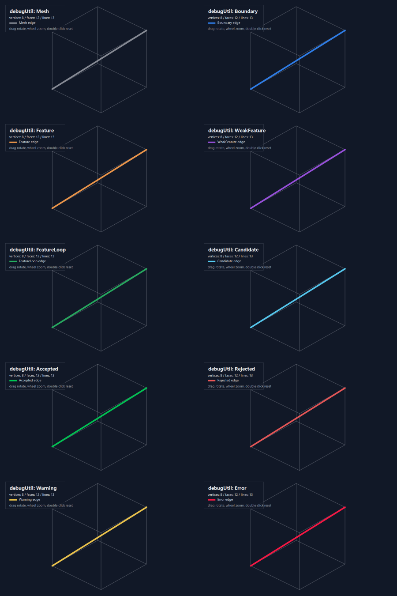
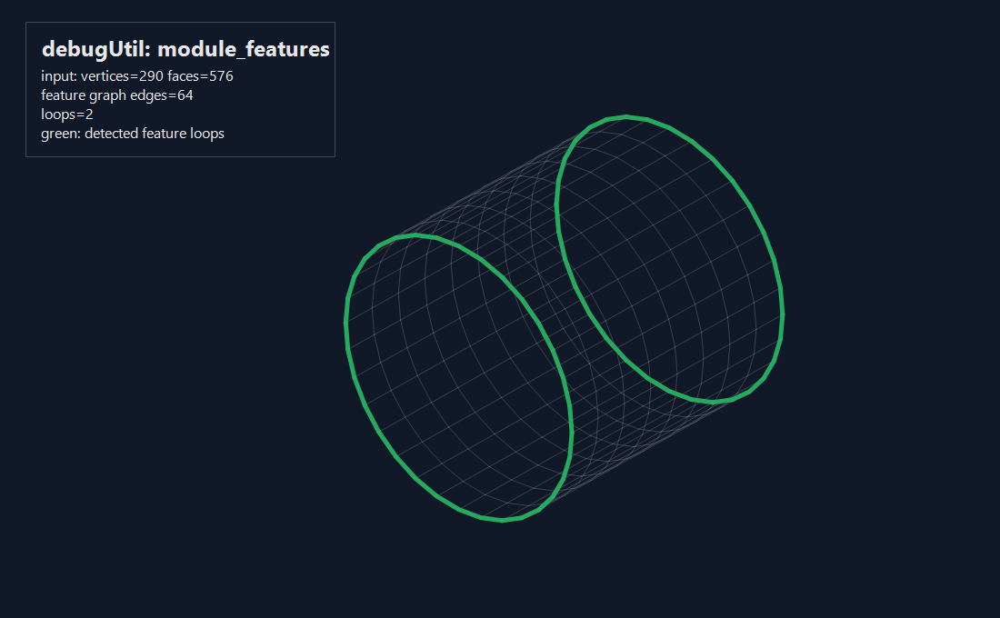
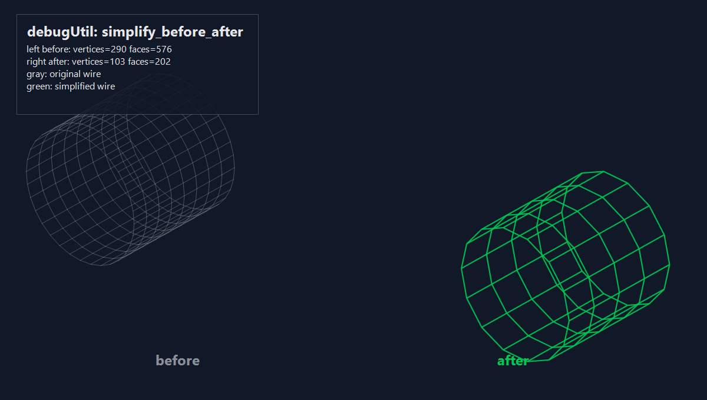

# debugUtil 使用教程

`debugUtil` 是 ManuMesh 内部使用的 Debug-only 线框可视化工具。它的目标不是做正式 viewer，而是在排查算法问题时用一行代码生成本地 HTML，快速看清网格、特征边、坏 collapse、简化前后差异等问题。

## 适用场景

- 看输入网格线框是否异常。
- 看 feature detection 识别到了哪些边和 loop。
- 看某条候选边、拒绝边或异常边在哪里。
- 对比简化前后的线框密度和拓扑变化。

它不属于 SDK/API 交付能力，也不会进入 public install headers。

## 截图预览

不同 `UseCase` 会用不同颜色表达调试意图：



模块识别到的 feature、weak feature、boundary 和 feature loop 可以叠加在同一张线框图上：



简化前后对比会左右并排显示两个网格，适合快速检查线框密度和拓扑变化：



## 开启方式

默认构建中 `debugUtil` 是 no-op。需要显式打开 CMake 开关，并使用 Debug 构建：

```powershell
cmake -S . -B build\debug-util-mingw `
  -G Ninja `
  -DCMAKE_BUILD_TYPE=Debug `
  -DCMAKE_C_COMPILER=gcc `
  -DCMAKE_CXX_COMPILER=g++ `
  -DMANUMESH_ENABLE_DEBUG_UTIL=ON
cmake --build build\debug-util-mingw --parallel
```

开启后，ManuMesh 内部 C++ 源文件会自动 force-include `debugUtil/debugUtil.h`，所以在内部 `.cpp` 中可以直接写宏，不需要手动加 include。

## 输出位置

默认输出到系统临时目录：

```text
%TEMP%\manumesh-debugUtil
```

每次调用会生成一个带时间戳的 `.html` 文件，并在标准错误输出中打印路径：

```text
manumesh debugUtil: C:\Users\...\Temp\manumesh-debugUtil\...\tag.html
```

可以用环境变量改输出目录：

```powershell
$env:MANUMESH_DEBUG_UTIL_DIR = "E:\tmp\manumesh-debug"
```

默认会尝试自动打开浏览器。调试批量流程时可以关闭自动打开：

```powershell
$env:MANUMESH_DEBUG_UTIL_OPEN = "0"
```

## 最常用入口

### 1. 查看普通线框

```cpp
MANUMESH_DEBUG_UTIL_WIREFRAME("input_mesh", mesh);
```

用途：确认输入网格是否存在明显孔洞、错位、异常长边、拓扑断裂等问题。

### 2. 查看特征识别结果

```cpp
const manumesh::feature::FeatureAnalysis analysis =
    manumesh::feature::detectFeatureCurves(mesh, options);

MANUMESH_DEBUG_UTIL_FEATURES("feature_detection", mesh, analysis);
```

用途：查看 feature graph、boundary、normal tensor weak feature 和 recovered loops。

### 3. 查看某条边

```cpp
MANUMESH_DEBUG_UTIL_EDGE_LABEL(
    "bad_collapse",
    mesh,
    keep,
    remove,
    manumesh::debugUtil::UseCase::Rejected,
    "topology rejected");
```

用途：定位某次 collapse 为什么被拒绝，或确认候选边是否落在预期位置。

### 4. 对比简化前后

```cpp
MANUMESH_DEBUG_UTIL_BEFORE_AFTER(
    "simplify_before_after",
    input,
    simplified);
```

用途：左右并排显示两个线框。左侧为简化前，右侧为简化后，面板中会显示各自的 vertex/face/edge 数量。

## 颜色约定

`UseCase` 决定线段颜色和线宽：

| UseCase | 颜色语义 |
| --- | --- |
| `Mesh` | 普通网格线，灰色 |
| `Boundary` | 边界边，蓝色 |
| `Feature` | 普通特征边，橙色 |
| `WeakFeature` | 弱特征或 normal tensor 特征，紫色 |
| `FeatureLoop` | 已恢复的特征环，绿色 |
| `Candidate` | 候选边或临时调试边，青色 |
| `Accepted` | 已接受/简化后结果，亮绿色 |
| `Rejected` | 被拒绝的 collapse 或非法边，红色 |
| `Warning` | 可疑但未必错误的边，黄色 |
| `Error` | 明确错误或非流形异常，亮红色 |

## 自定义多条覆盖边

需要一次画多条特殊边时，可以传 `EdgeOverlay`：

```cpp
std::vector<manumesh::debugUtil::EdgeOverlay> overlays;
overlays.push_back({a, b, manumesh::debugUtil::UseCase::Candidate, "candidate"});
overlays.push_back({c, d, manumesh::debugUtil::UseCase::Rejected, "rejected"});

MANUMESH_DEBUG_UTIL_EDGES("collapse_check", mesh, overlays);
```

基础网格仍会以灰色线框显示，覆盖边按各自 `UseCase` 着色。

## 推荐插入位置

特征识别调试：

```cpp
FeatureAnalysis analysis = pipeline.run(mesh, options);
MANUMESH_DEBUG_UTIL_FEATURES("after_feature_detection", mesh, analysis);
```

简化前后调试：

```cpp
Mesh simplified = simplifier.simplify(input, features);
MANUMESH_DEBUG_UTIL_BEFORE_AFTER("simplify_result", input, simplified);
```

collapse 拒绝调试：

```cpp
if (!result.accepted()) {
  MANUMESH_DEBUG_UTIL_EDGE_LABEL(
      "collapse_rejected",
      input_,
      edge.keep,
      edge.remove,
      manumesh::debugUtil::UseCase::Rejected,
      "rejected");
}
```

## 注意事项

- Release 或未开启 `MANUMESH_ENABLE_DEBUG_UTIL` 时，所有宏都会展开成 `((void)0)`。
- HTML 是本地调试产物，不要把它作为测试基线或交付物。
- 大网格全量线框会比较密，建议优先在局部问题处使用 `EDGE` / `EDGES`。
- 如果在循环里调用，建议设置 `MANUMESH_DEBUG_UTIL_OPEN=0`，避免一次打开大量浏览器窗口。
- 这个工具只画线框，不渲染面；如果需要判断遮挡、法向或面片局部状态，可以先用标签和局部边定位问题，再用正式 mesh 查看器复核。
